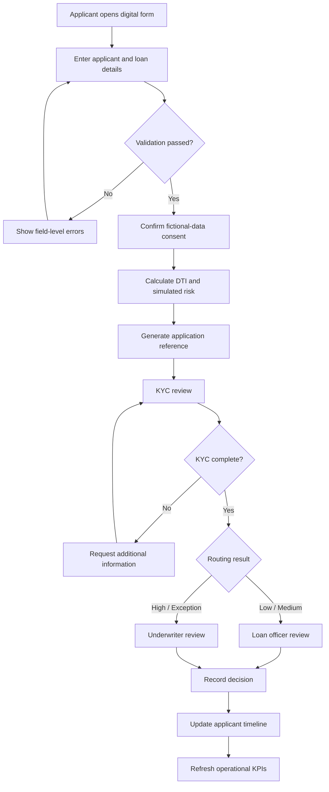

# 04 — Process Flows

## Current-state problem flow

1. Applicant provides information through separate or manual channels.
2. Operations checks whether information and documents are complete.
3. Missing information is requested through follow-up communication.
4. Loan officer manually calculates affordability and reviews credit information.
5. Exceptions are escalated without a consistent routing indicator.
6. Status updates are provided manually.
7. Management reporting is assembled from separate records.

### Current-state pain points

- Repeated data entry and incomplete applications
- Inconsistent affordability calculation
- Limited applicant visibility
- Manual prioritization and reporting
- Weak requirement-to-test traceability

## Future-state workflow

## Status model

| Status | Meaning | Permitted next status |
|---|---|---|
| Draft | Application not submitted | Submitted |
| Submitted | Validation passed and reference created | KYC Review |
| KYC Review | Identity and document checks simulated | More Information, Credit Assessment |
| More Information | Missing or unclear information | KYC Review |
| Credit Assessment | Affordability and risk reviewed | Officer Review, Underwriter Review |
| Officer Review | Standard manual assessment | Approved, Declined, Underwriter Review |
| Underwriter Review | Higher-risk or exception assessment | Approved, Declined |
| Approved | Demonstration approval recorded | Completed |
| Declined | Demonstration decline recorded | Completed |
| Completed | Workflow closed | None |

## Target improvements

- Validate data at the point of entry.
- Calculate DTI consistently and visibly.
- Route exceptional cases transparently.
- Provide a reusable status timeline.
- Generate operational metrics from a standard workflow.
